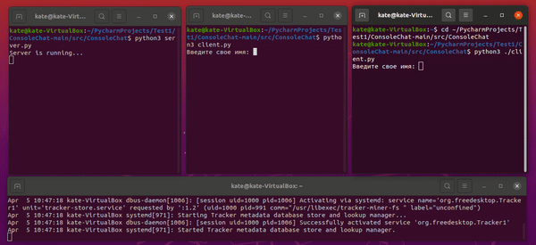

# Console Chat



A  simple console chat supporting following functionality:

**Server**

- receivies requests from clients via TCP-port
- supports multiple clients  simultaneously
- logs clients' messages to syslog

**Client**

- sends & receivies messages
- gets a message delivery status
## Installation

1) Get the source code:


```bash
 wget https://github.com/EkaterinaMoroz/ConsoleChat/archive/refs/heads/main.zip
```
2) Unzip the archive: 

```bash
  unzip main.zip
```
3) Run the server part
a. To run server locally:

```bash
  python3 main/src/ConsoleChat/server.py
```
b. To run on remote server change the ip adress:

```bash
  nano ConsoleChat-main/src/ConsoleChat/server.py
```
Change the adress inside the double quotes:

SERVER_ADDRESS = ("localhost", 7759) -> SERVER_ADDRESS = ("127.0.0.1", 7759)

```bash
  python3 main/src/ConsoleChat/server.py
```
4) In a new terminal tab run the client part
a. To run client locally:
```bash
  python3 main/src/ConsoleChat/client.py
```
b. To run client with remote server set the server's address:

```bash
  nano ConsoleChat-main/src/ConsoleChat/server.py
```
Change the adress inside the double quotes:

SERVER_ADDRESS = ("localhost", 7759) -> SERVER_ADDRESS = ("127.0.0.1", 7759)

```bash
  python3 main/src/ConsoleChat/client.py
```
